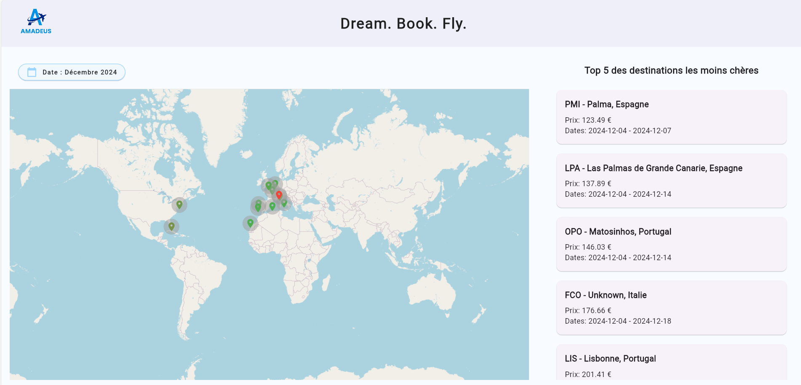
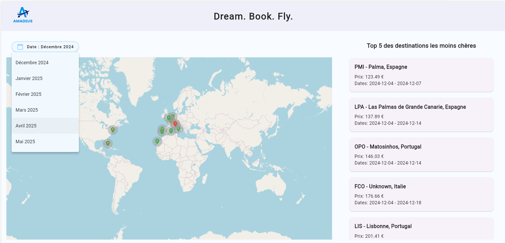
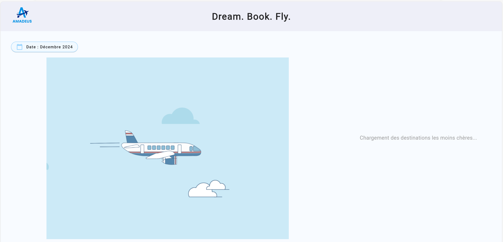
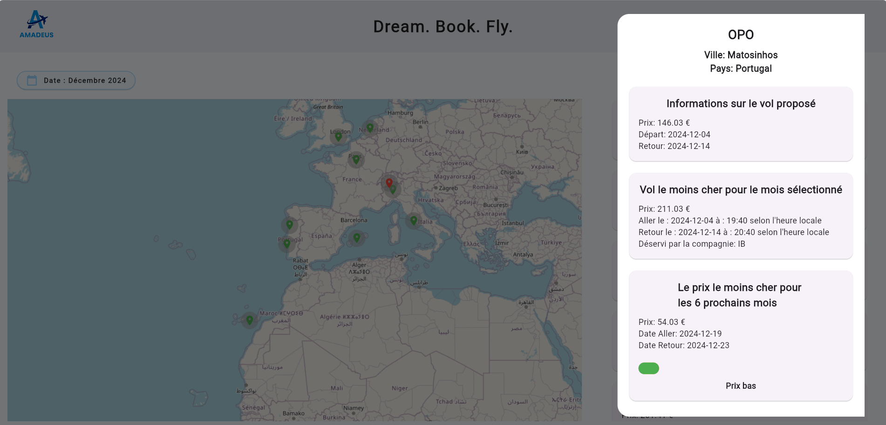
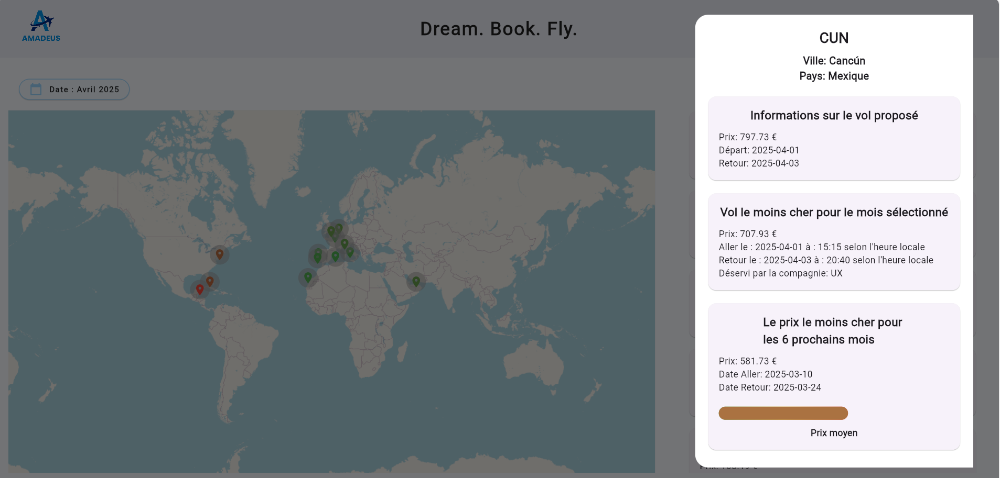

<div align="center">
  
  <h1 style="margin-top: -10px;">Dream. Book. Fly.</h1>

  <p align="center">
    Clémence ANDRE • Estelle CLEMENT • Noëlie COMTE • Chloé PICHEREAU
  </p>
</div>

Un Dashboard Flutter qui permet de visualiser les vols les moins chers au départ de Madrid vers différentes destinations sur une carte interactive.



## 🌟 Fonctionnalités

- Sélection de dates sur 6 mois glissants
- Visualisation des destinations sur une carte interactive pour le mois sélectionné
- Affichage des 5 destinations les moins chères pour le mois choisi
- Détails des vols pour chaque destination (prix, dates, compagnie aérienne)
- Propositions du vol le moins cher sur une période de 6 mois

## 📸 Aperçu de l'application

<div align="center">

  
  <p><em>Sélection des dates de voyage</em></p>

  
  <p><em>Chargement des résultats</em></p>

  
  <p><em>Résultat de la recherche pour le mois sélectionné</em></p>

  
  <p><em>Détails d'une destination avec les informations de vol</em></p>

  
  <p><em>Détails d'une autre destination avec les informations de vol</em></p>
</div>

## 🚀 Pour commencer

### Prérequis

Avant de lancer l'application, vous devez :

1. Obtenir un accès temporaire à l'API CORS Anywhere en :
   - Visitant [https://cors-anywhere.herokuapp.com/corsdemo](https://cors-anywhere.herokuapp.com/corsdemo)
   - Cliquant sur le bouton "Request temporary access to the demo server"

2. Avoir Flutter installé sur votre machine

### Installation

1. Clonez le repository
```
git clone https://github.com/clemenceandre/flutter-dashboard.git
```

2. Installez les dépendances
```
flutter pub get
```

3. Lancez l'application
```
flutter run
```

